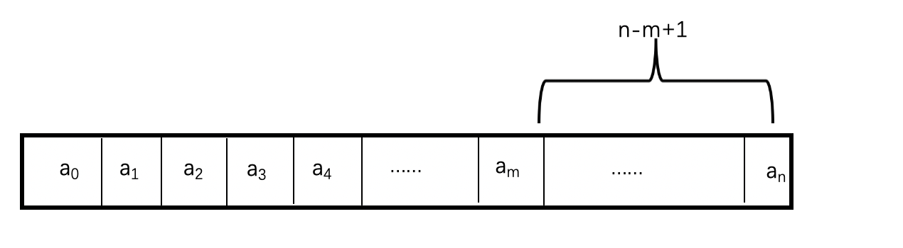

算法这种东西真的丢久了不打就会生疏很多啊，三个多月没怎么打就有点吃不消Leetcode周赛了，确实懒惰了很多，今天重新捡起来Leetcode周赛，只打了3道题目，还是有点失望的，因为有一题是瞎混过去的，所以还是挺失望的，那为了保证手感，所以决定以后每周日都要打周赛，还要写博客来记录自己的历程。

1352.Product of the Last K Numbers
-----------
题目大意：求某个arry的倒数k个数的乘积，但是是在添加元素的过程中来计算的。

思考：一拿到这个题目的时候，我是直接用的模拟，每次计算都用一个for循环，但是超时了，所以很容易想到前缀和，那就用前缀积呗，但是写完了前缀积之后，我发现了一个问题，那就是如果添加0进去，那么会出现除以0的情况，那这样的情况怎么解决呢，我们这样想，假如有一个数组`vector[int]a`，如果`a[m]=0`，那么当我们计算倒数k个数字的乘积的时候，如果设`n=a.size()-1`的时候，那么当`k>=n-m+1`的时候，倒数k个数字的积一定为0，所以，我们可以简化我们的存储形式，一旦遇到了0的话，之前所有的数字都没有任何意义了，所以是不需要保存的，只需要保存之后add进来的数据。




实现代码:

```C++
class ProductOfNumbers {
public:
    vector<long long>a;
    ProductOfNumbers() {
        a={1};
    }
    void add(int num)
    {
        if(num)
            a.push_back(a.back()*num);
        else
            a={1};
    }
    
    int getProduct(int k)
    {
        return k<a.size()?(int)a[a.size()-1]/a[a.size()-k-1]:0;
    }
};
```

1353.Maximum Number of Events That Can Be Attended
-------
题目大意：每天只能参加一次会议，但是参加之后今天就算结束了，一天只能参加一次会议，只要会议还没结束，都可以参加这次会议，求参加会议的最大次数。这时候你可能会想当然的认为你，可以直接数不同开始天数的个数不就好了，但是给你看一种情况有两个会议，都是第一天就开始，第二天结束，但是这种情况的个数是2，因为第二个会议可以第二天再参加，所以分析的得来应该就是队列的知识，优先队列最简单，按每天迭代，优先队列里面存的是结束的天数。下面看代码吧：

```c++
int maxEvents(vector<vector<int>>& events)
{
    priority_queue<int,vector<int>,greater<int>>q;
    int res=0;
    sort(events.begin(),events.end());
    int num=(int)events.size();
    int index=0;
    for(int d=1;d<=1e5;++d)
    {
        while(index<num&&events[index][0]==d)
            q.push(events[index++][1]);
        while(q.size()!=0&&q.top()<d)
            q.pop();
        if(q.size()!=0)
        {
            q.pop();
            res++;
        }
    }
    return res;
}

```