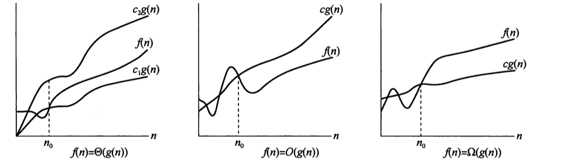
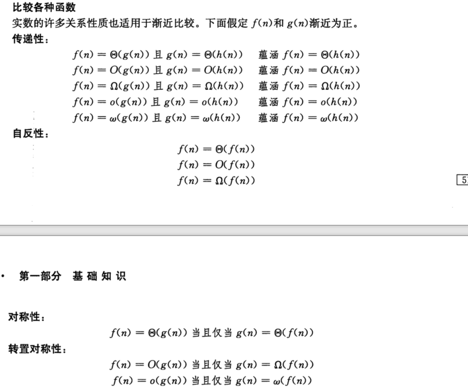

### 3.1渐近符号

* $\Theta$符号

$\Theta(g(n))=\{f(n),\exist c_1,c_2>0,\forall n\ge n_0>0,0\leq c_1g(n)\leq f(n)\leq c_2g(n) \}$

$\Theta$是比较强的符号，既要确定上界也要确定下届，其实$\Theta$就是说明了f(n)和g(n)之间的比是常数的关系。

* $O$符号

$O(g(n))=\{f(n),\exist c>0,\forall n\ge n_0>0,0\leq f(n)\leq cg(n) \}$

$O$符号比较弱，只是确定了上界，满足$\Theta$一定满足$O$;

* $\Omega$符号

$\Omega(g(n))=\{f(n),\exist c>0,\forall n\ge n_0>0,0\leq cg(n)\leq f(n) \}$

$\Omega$符号比较弱，只是确定了下界满足$\Theta$一定满足$\Omega$;

* $o$标记
$O(g(n))=\{f(n),\exist c>0,\forall n\ge n_0>0,0\leq f(n)< cg(n) \}$

$f(n)=o(g(n))\Leftrightarrow \lim_{n\rightarrow \infty}\frac{f(n)}{g(n)}=0$

$o$标记是$O$标记的特殊情况，$o$标记表示一个非渐近紧确的上界。
* $\omega$标记

$\omega(g(n))=\{f(n),\exist c>0,\forall n\ge n_0>0,0\leq cg(n)< f(n) \}$

$f(n)=\omega(g(n))\Leftrightarrow \lim_{n\rightarrow \infty}\frac{f(n)}{g(n)}=\infty$

$\omega$标记是$\Omega$标记的特殊情况，$\omega$标记表示一个非渐近紧确的上界。

### 3.2标准记号与常用函数

对数的一些性质
-----
$a^{log_bc=c^{log_ba}}$

斯特林公式
-----
$n !=\sqrt{2 \pi n}\left(\frac{n}{\mathrm{e}}\right)^{n}\left(1+\Theta\left(\frac{1}{n}\right)\right)$

多重对数函数
----

$\lg ^{*} n=\min \left\{i \geqslant 0, \lg ^{(i)} n \leqslant 1\right\}$

多项式有界
----
如果存在某个常量k，使得$f(n)=O(n^k)$则称$f(n)$是多项式有界的。

Tips:一般证明多项式有界会取对数。

一些常见的界
----
$\begin{aligned} n ! &=o\left(n^{n}\right) \\ n ! &=\omega\left(2^{n}\right) \\ \lg (n !) &=\Theta(n \lg n) \end{aligned}$

